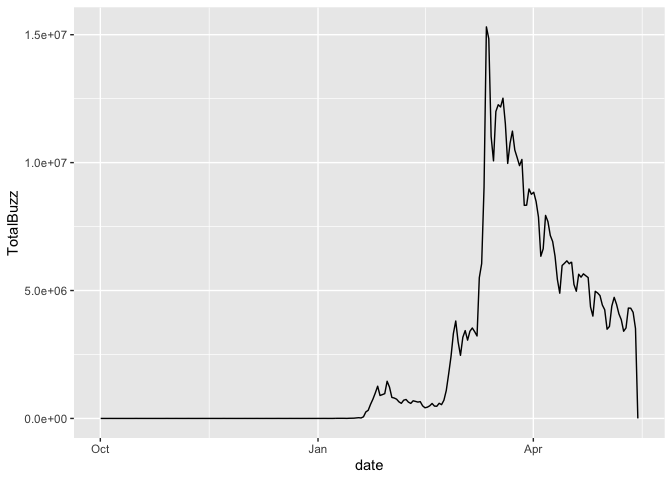
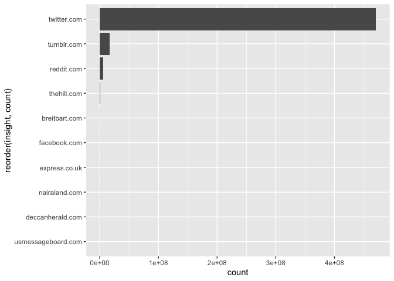
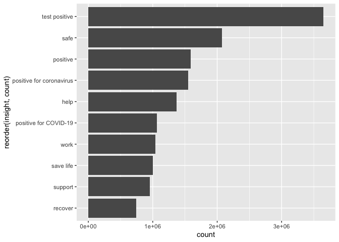

<!-- README.md is generated from README.Rmd. Please edit that file -->

# Netbase in R

<!-- badges: start -->

<!-- badges: end -->

The goal of the **netbase** package is to make it easy to work with the
Netbase API with R.

It was created at TBWA\\Chiat\\Day.

## Installation

You can install the development version from
[GitHub](https://github.com/) with:

    # install.packages("devtools")
    devtools::install_github("acastroaraujo/netbase")

## Set up

``` r
library(netbase)
```

If you try to use any function without authenticating first you’ll
receive an error message.

``` r
nb_hello_world("Spanish")
#> Error: Use nb_setup() to authenticate yourself!
```

Type in your user and password:

    nb_setup(user = ####, password = #####)

Once this is done an invisible variable called `.auth` will get saved to
your global environment.

``` r
nb_hello_world("Spanish")
#> $language
#> [1] "Spanish"
#> 
#> $message
#> [1] "¡Hola, mundo!"
```

## Example

``` r
mv <- nb_metric_values(topic_id = 1384327, time = "Day")
```

You can then visualize the data with tools like ggplot2

``` r
library(ggplot2)

ggplot(mv, aes(date, TotalBuzz)) + geom_line()
```



``` r
ic <- nb_insights_count(topic_id = 1384327, categories = c("Domains", "Likes"), size = 10)
#> You have exceeded your query rate limit.
#> Waiting for 80 seconds...

ggplot(ic$Domains, aes(count, reorder(insight, count))) + geom_col()
```



``` r
ggplot(ic$Likes, aes(count, reorder(insight, count))) + geom_col()
```



These are the main functions in this package:

  - `nb_list_themes()`

  - `nb_theme_definitions()`

  - `nb_list_topics()`

  - `nb_topic_definitions()`

  - `nb_insights_count()`

  - `nb_metric_values()`
